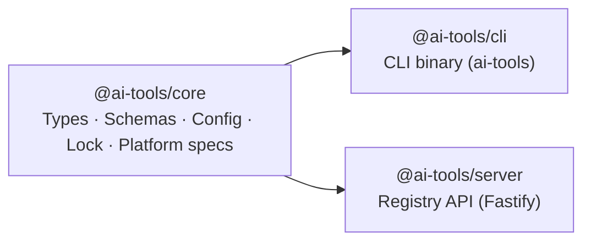
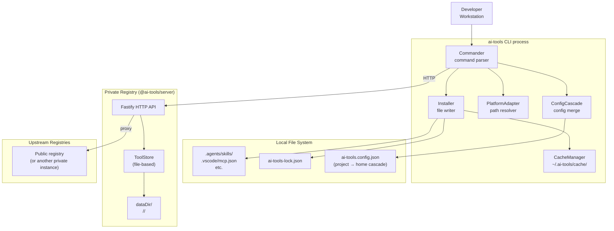
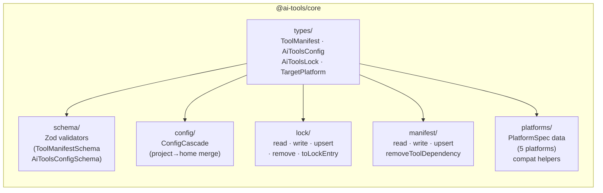
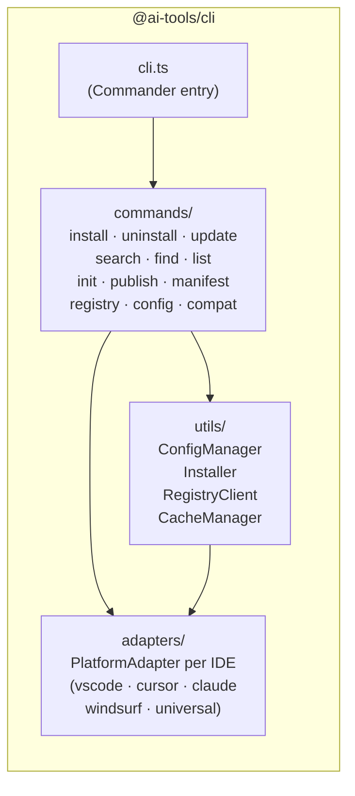
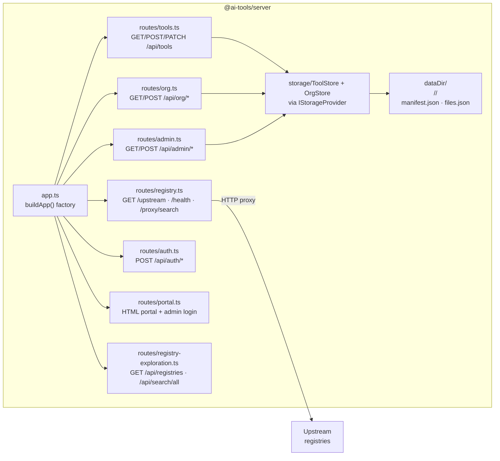
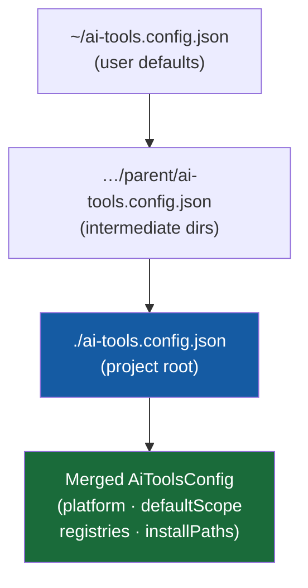
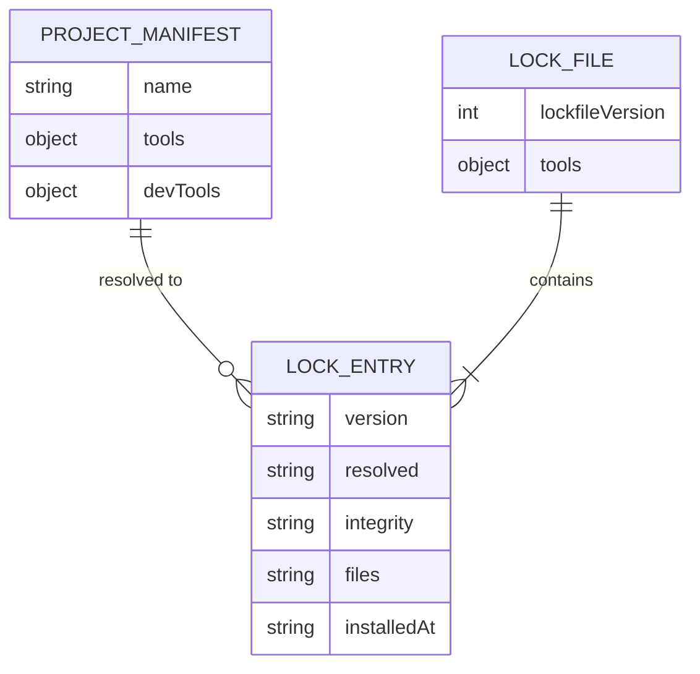

# System Architecture

ai-tools is a package manager for AI tools — skills, subagents, prompts, and MCP servers —
modelled closely on npm. It is composed of three packages in a monorepo, each with a distinct
responsibility.

---

## Package dependency graph

`@ai-tools/core` has no runtime dependencies on the other two packages.
`@ai-tools/cli` and `@ai-tools/server` both depend on `core` for types and schemas.

---

## Runtime topology

A typical deployment has a developer workstation running the CLI against one or more
registry servers. Registries can be chained — each one can proxy search queries and
tarball downloads to upstream registries.

---

## Package internals

### @ai-tools/core

Pure library — no CLI, no HTTP server. Imported by both `cli` and `server`.

### @ai-tools/cli

The `ai-tools` binary. Commands are thin orchestrators that delegate to utility classes.

### @ai-tools/server

Fastify HTTP registry. Stateless per-request — all state is in the file system.

---

## Config cascade

Configuration merges from home directory down to the project directory — project values
win. Registry arrays are merged with project registries prepended (highest priority).

**Merge rules:**
- Scalar values (`platform`, `defaultScope`): project overrides parent overrides home
- `registries` array: arrays are concatenated, project entries sorted to front by priority
- `installPaths` map: shallow merge, project keys override parent keys

---

## Lock file relationship

