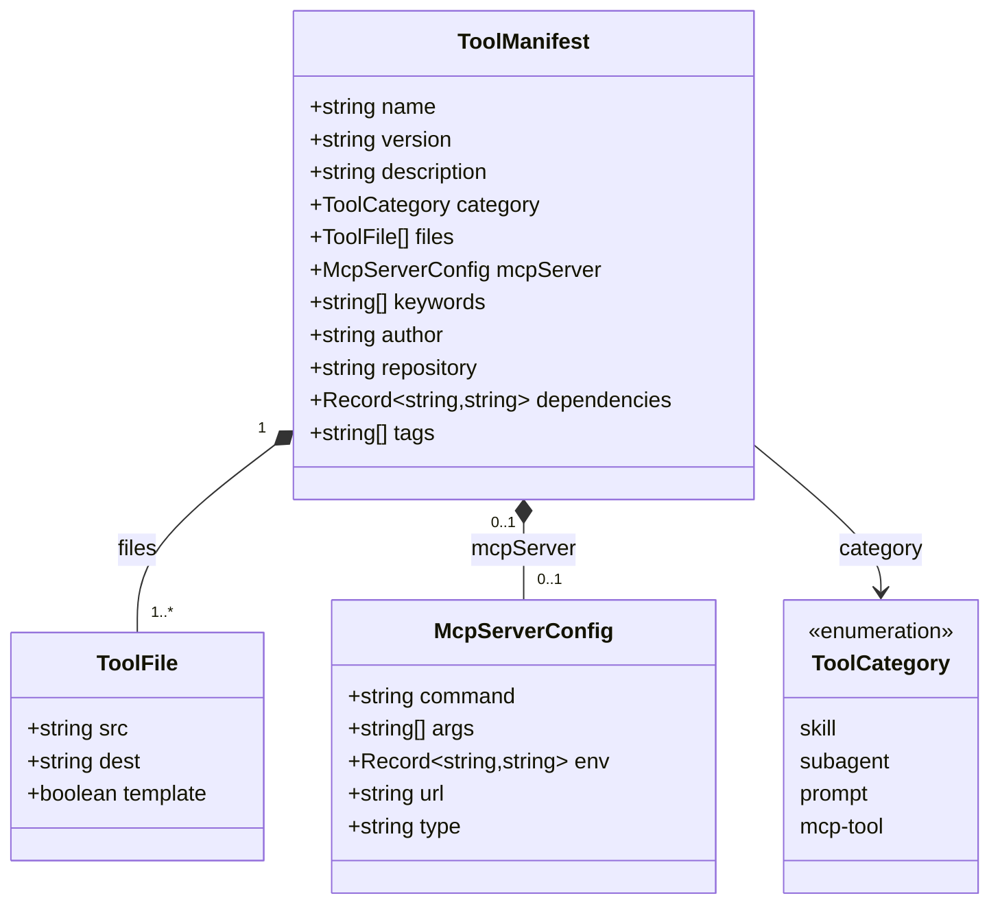
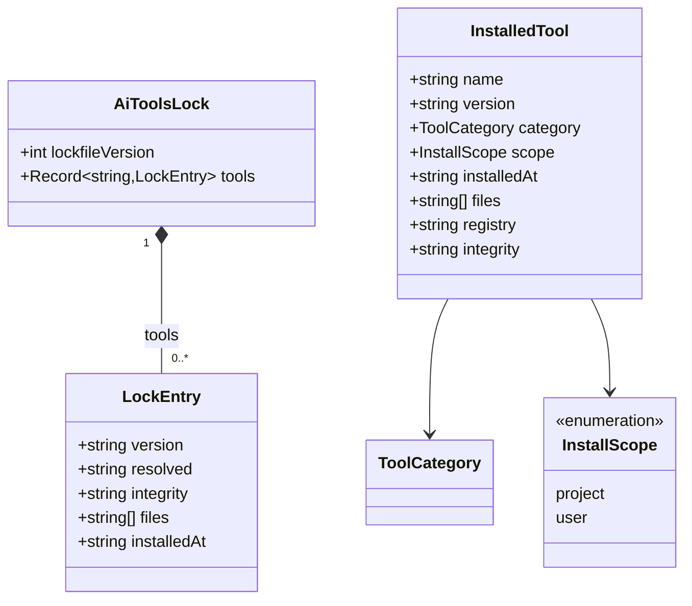
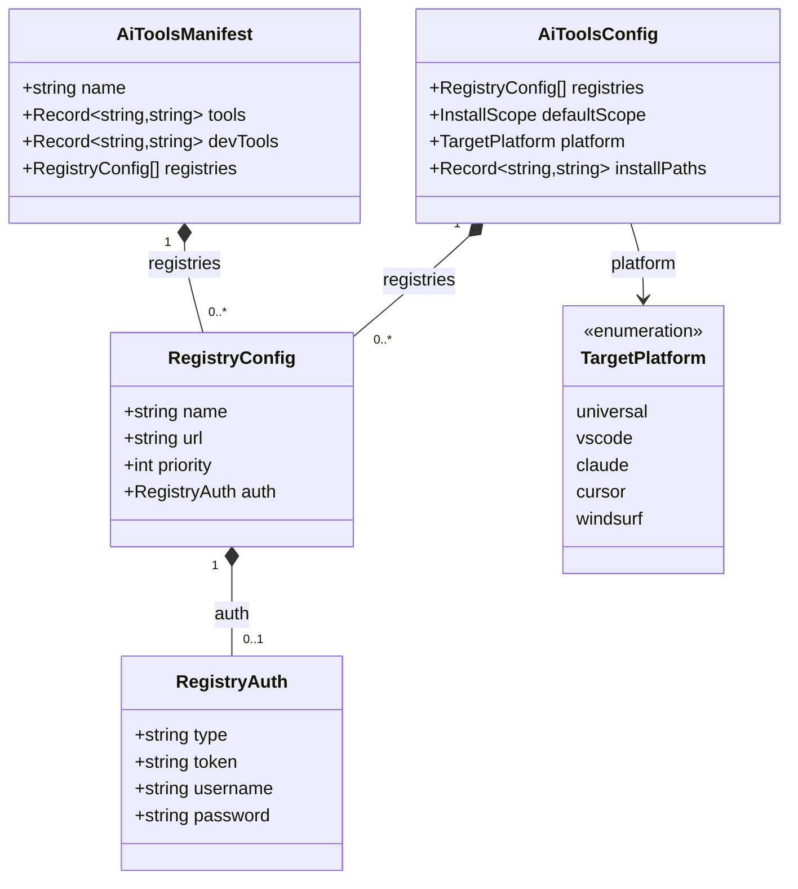
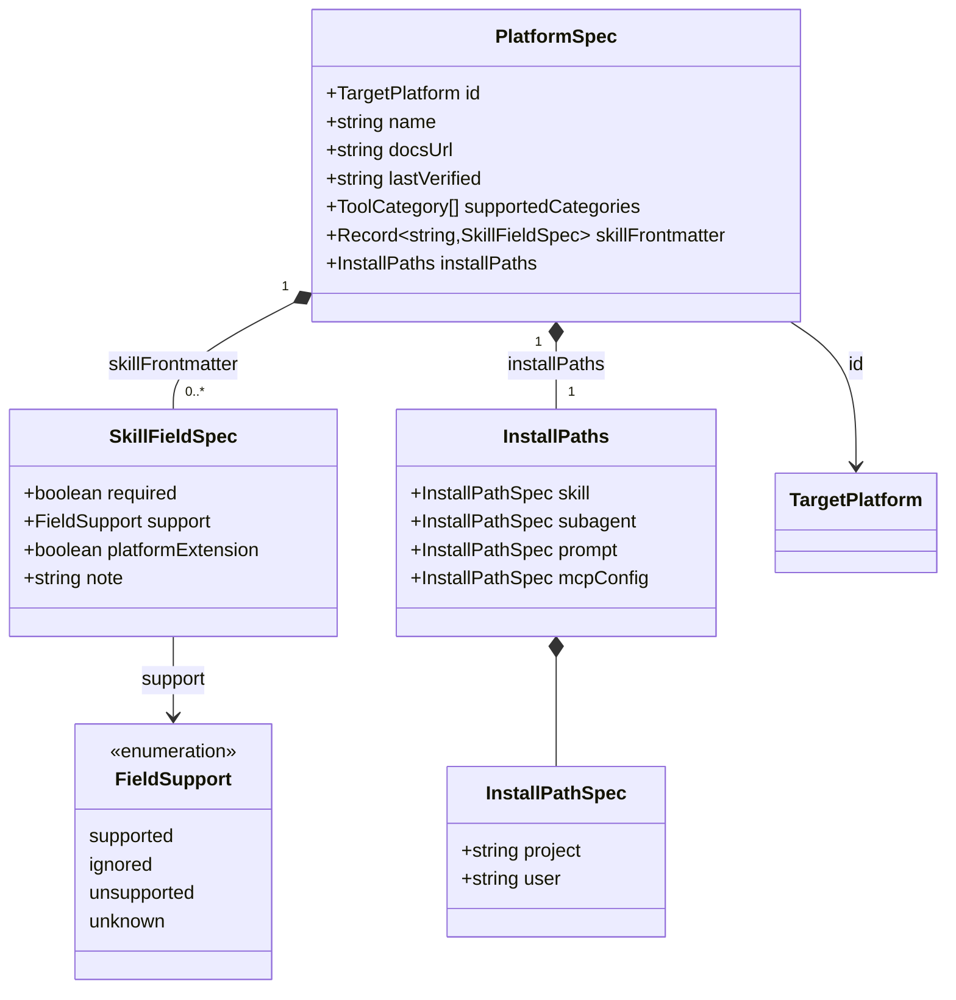
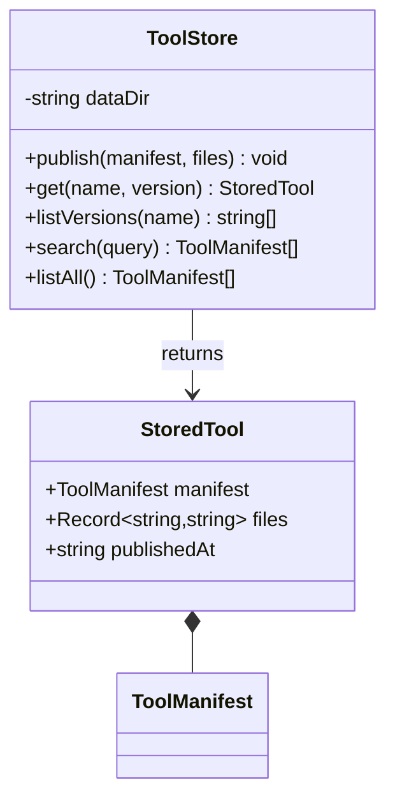
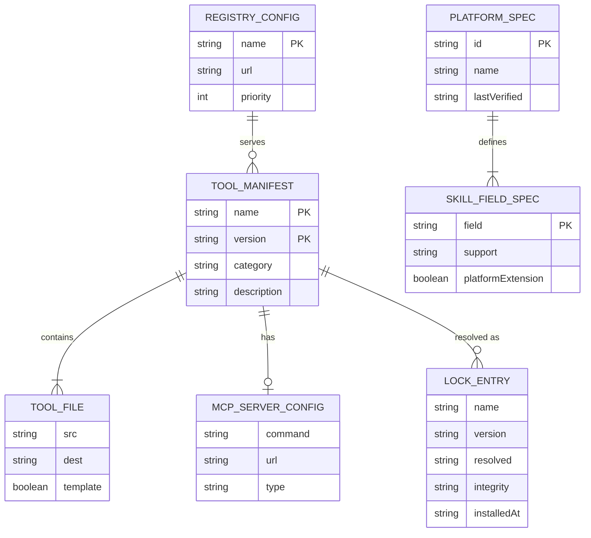

# Data Model

All core types are defined in `packages/core/src/types/`. Zod schemas in
`packages/core/src/schema/` validate the same shapes at runtime boundaries
(manifest files, registry API payloads, config files).

---

## Tool manifest

The central type. Published to the registry and downloaded by the installer.



---

## Installed tool and lock file

The lock file pins exact resolved versions for reproducible installs.
Analogous to `package-lock.json`.



`InstalledTool` is the in-memory representation used during an install operation.
`LockEntry` is the persisted form written to `ai-tools-lock.json`.
`toLockEntry(tool, resolved)` converts between them.

---

## Configuration



`AiToolsConfig` is the merged result of all `ai-tools.config.json` files on disk.
`AiToolsManifest` is `ai-tools.json` — the project-level tool dependency list.
`installPaths` keys use the format `"<scope>.<category>"`, e.g. `"project.skill"`.

---

## Platform spec

Used by the `compat` command to audit SKILL.md frontmatter compatibility and
to document install paths per platform.



`lastVerified` is an ISO-8601 date. The `compat` command treats specs older than
90 days (`SPEC_STALE_DAYS`) as unverified and emits a warning.

---

## Server storage



The on-disk layout mirrors `npm`'s local cache:

```
dataDir/
└── <sanitized-name>/
    └── <version>/
        ├── manifest.json
        └── files.json
```

`files.json` is a `Record<string, string>` mapping source paths to file contents.
Tarballs are synthesised on-the-fly when `GET /tools/:name/:version/tarball` is called.

---

## Type relationship overview



---

## PostgreSQL Database Schema

The registry server uses PostgreSQL for persistent storage. The schema includes:

### Tables

```sql
-- Tools registry — composite PK because each (name, version) is a distinct record
CREATE TABLE tools (
    name TEXT NOT NULL,
    version TEXT NOT NULL,
    category TEXT NOT NULL,
    description TEXT,
    published_at TIMESTAMPTZ DEFAULT NOW(),
    PRIMARY KEY (name, version)
);

-- Tool manifests (JSONB for flexibility)
CREATE TABLE tool_manifests (
    tool_name TEXT NOT NULL,
    tool_version TEXT NOT NULL,
    manifest JSONB NOT NULL,
    PRIMARY KEY (tool_name, tool_version),
    FOREIGN KEY (tool_name, tool_version) REFERENCES tools(name, version)
);

-- Tool files
CREATE TABLE tool_files (
    tool_name TEXT NOT NULL,
    tool_version TEXT NOT NULL,
    file_path TEXT NOT NULL,
    file_content TEXT NOT NULL,
    PRIMARY KEY (tool_name, tool_version, file_path),
    FOREIGN KEY (tool_name, tool_version) REFERENCES tools(name, version)
);

-- Registry configurations
CREATE TABLE registries (
    name TEXT PRIMARY KEY,
    url TEXT NOT NULL,
    priority INTEGER NOT NULL,
    access_mode TEXT NOT NULL,
    created_at TIMESTAMPTZ DEFAULT NOW()
);

-- Users and authentication
CREATE TABLE users (
    id UUID PRIMARY KEY DEFAULT gen_random_uuid(),
    username TEXT UNIQUE NOT NULL,
    email TEXT UNIQUE,
    created_at TIMESTAMPTZ DEFAULT NOW()
);

-- Sessions
CREATE TABLE sessions (
    id UUID PRIMARY KEY DEFAULT gen_random_uuid(),
    user_id UUID REFERENCES users(id),
    token TEXT UNIQUE NOT NULL,
    expires_at TIMESTAMPTZ NOT NULL,
    created_at TIMESTAMPTZ DEFAULT NOW()
);

-- Audit log
CREATE TABLE audit_log (
    id BIGSERIAL PRIMARY KEY,
    action TEXT NOT NULL,
    resource TEXT,
    details JSONB,
    user_id UUID REFERENCES users(id),
    created_at TIMESTAMPTZ DEFAULT NOW()
);
```

### Indexes

```sql
CREATE INDEX idx_tools_name ON tools(name);
CREATE INDEX idx_tools_category ON tools(category);
CREATE INDEX idx_tool_manifests_name ON tool_manifests(tool_name);
CREATE INDEX idx_sessions_token ON sessions(token);
CREATE INDEX idx_sessions_expires ON sessions(expires_at);
CREATE INDEX idx_audit_log_action ON audit_log(action);
CREATE INDEX idx_audit_log_created ON audit_log(created_at);
```

### Views

```sql
-- Latest version of each tool
CREATE VIEW latest_tools AS
SELECT name, version, description, published_at
FROM tools
WHERE (name, version) IN (
    SELECT name, MAX(version)
    FROM tools
    GROUP BY name
);

-- Tool statistics
CREATE VIEW tool_stats AS
SELECT 
    t.name,
    COUNT(DISTINCT t.version) as version_count,
    SUM(CASE WHEN t.category = 'skill' THEN 1 ELSE 0 END) as skill_count,
    SUM(CASE WHEN t.category = 'subagent' THEN 1 ELSE 0 END) as subagent_count,
    SUM(CASE WHEN t.category = 'prompt' THEN 1 ELSE 0 END) as prompt_count,
    SUM(CASE WHEN t.category = 'mcp-tool' THEN 1 ELSE 0 END) as mcp_count
FROM tools t
GROUP BY t.name;
```

---
