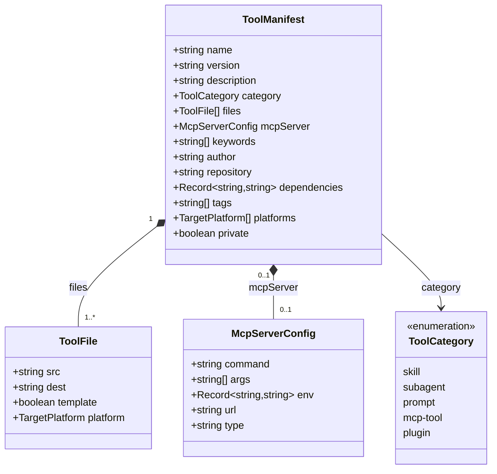
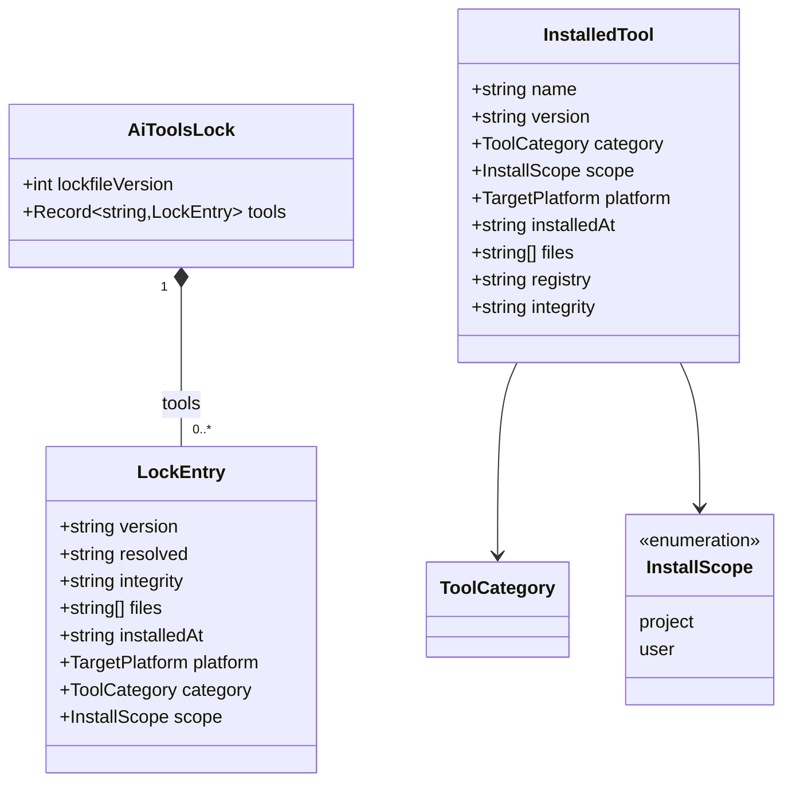
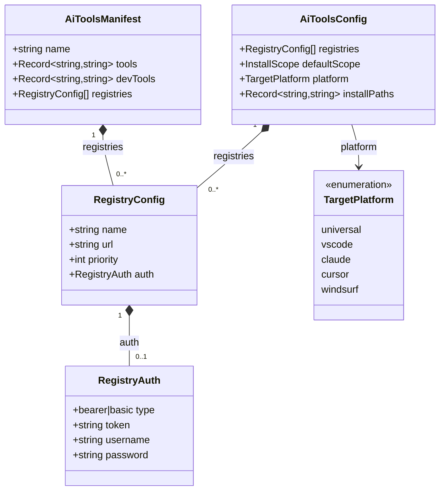
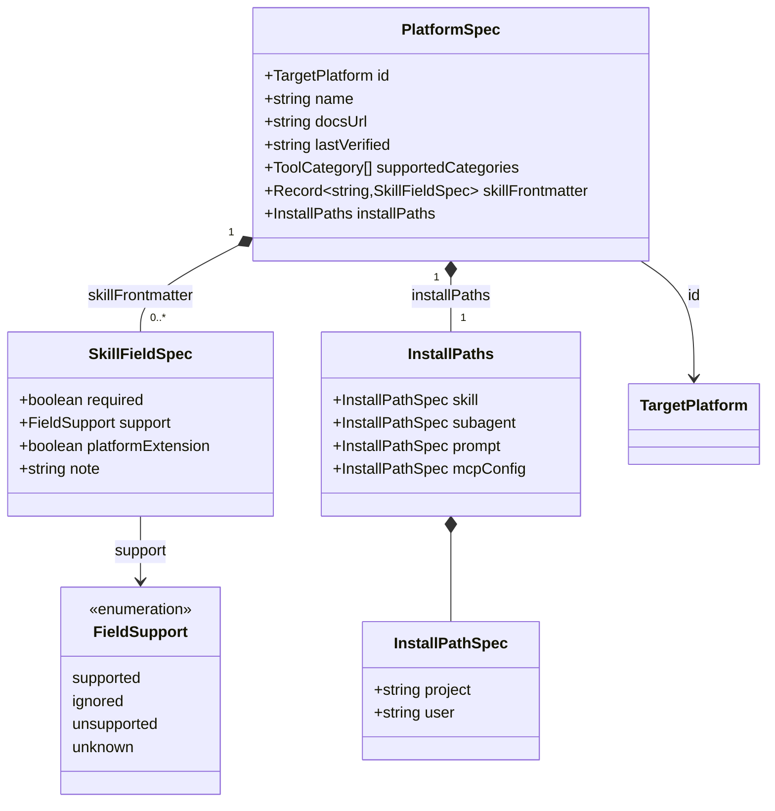
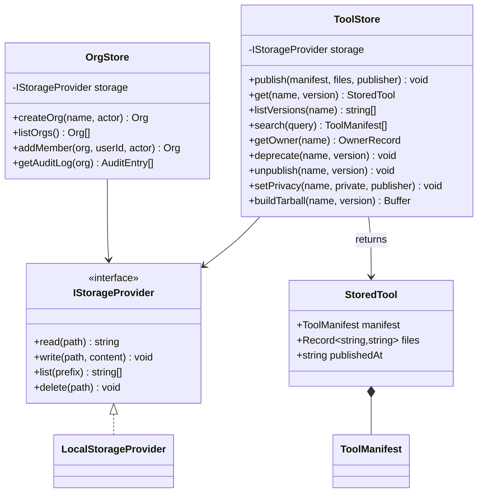
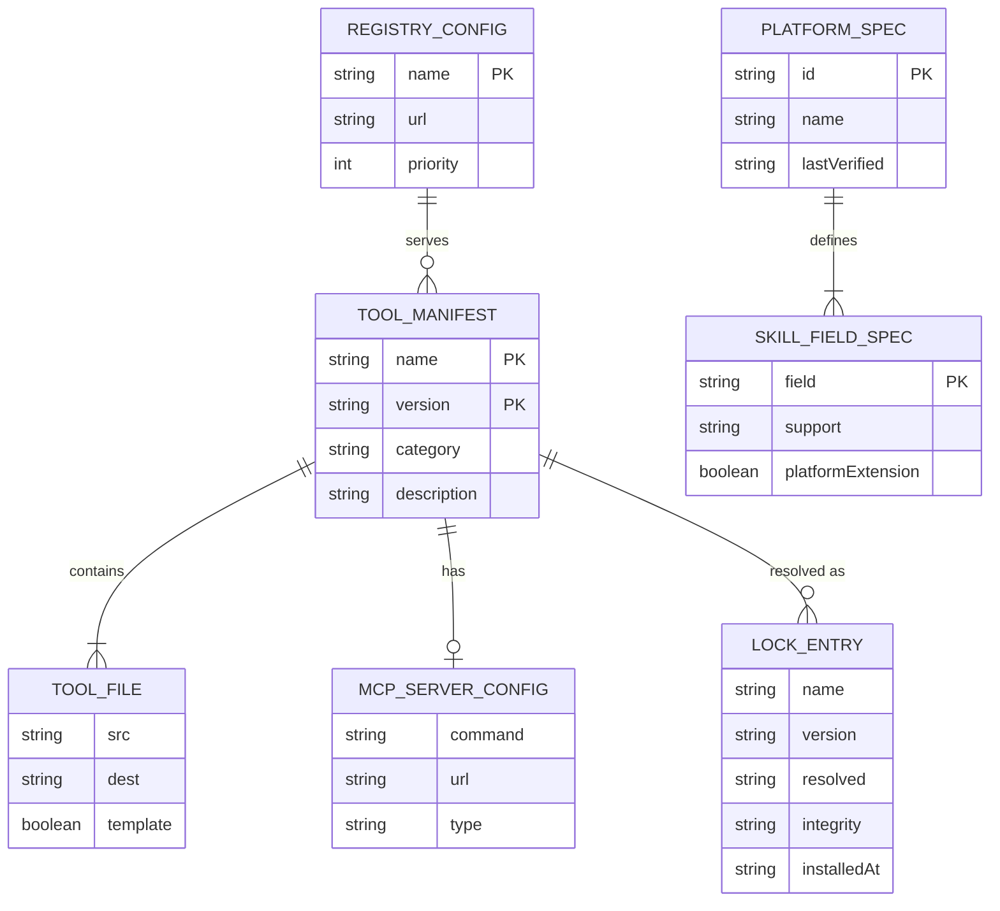

# Data Model

All core types are defined in `packages/core/src/types/`. Zod schemas in
`packages/core/src/schema/` validate the same shapes at runtime boundaries
(manifest files, registry API payloads, config files).

---

## Tool manifest

The central type. Published to the registry and downloaded by the installer.



---

## Installed tool and lock file

The lock file pins exact resolved versions for reproducible installs.
Analogous to `package-lock.json`.



`InstalledTool` is the in-memory representation used during an install operation.
`LockEntry` is the persisted form written to `aitools-lock.json`.
`toLockEntry(tool, resolved)` converts between them.

---

## Configuration



`AiToolsConfig` is the merged result of all `aitools.config.json` files on disk.
`AiToolsManifest` is `aitools.json` — the project-level tool dependency list.
`installPaths` keys use the format `"<scope>.<category>"`, e.g. `"project.skill"`.

---

## Platform spec

Used by the `compat` command to audit SKILL.md frontmatter compatibility and
to document install paths per platform.



`lastVerified` is an ISO-8601 date. The `compat` command treats specs older than
90 days (`SPEC_STALE_DAYS`) as unverified and emits a warning.

---

## Server storage

Tool data is persisted via `IStorageProvider` (default: `LocalStorageProvider`). PostgreSQL is **not** used for tool storage — it is only used for user/auth when `DATABASE_URL` is configured.



### On-disk layout

```
dataDir/
├── orgs.json
├── audit-log.jsonl
└── <sanitized-name>/
    ├── owner.json
    └── <version>/
        ├── manifest.json
        ├── files.json
        └── deprecated.json   (optional)
```

`files.json` is a `Record<string, string>` mapping source paths to file contents.
Tarballs are synthesised on-the-fly when `GET /api/tools/:name/:version/tarball` is called as a JSON array of `{ path, content }` objects.

---

## Type relationship overview



---

## PostgreSQL (auth only)

When `DATABASE_URL` is set and user management is enabled, PostgreSQL stores users and API tokens via `UserStore`. Tool manifests and files remain on the filesystem (or future cloud storage provider).

Migrations live in `packages/server/src/db/migrations/`. Org metadata and audit logs are stored in `orgs.json` and `audit-log.jsonl` on the storage provider, not in PostgreSQL.

---
