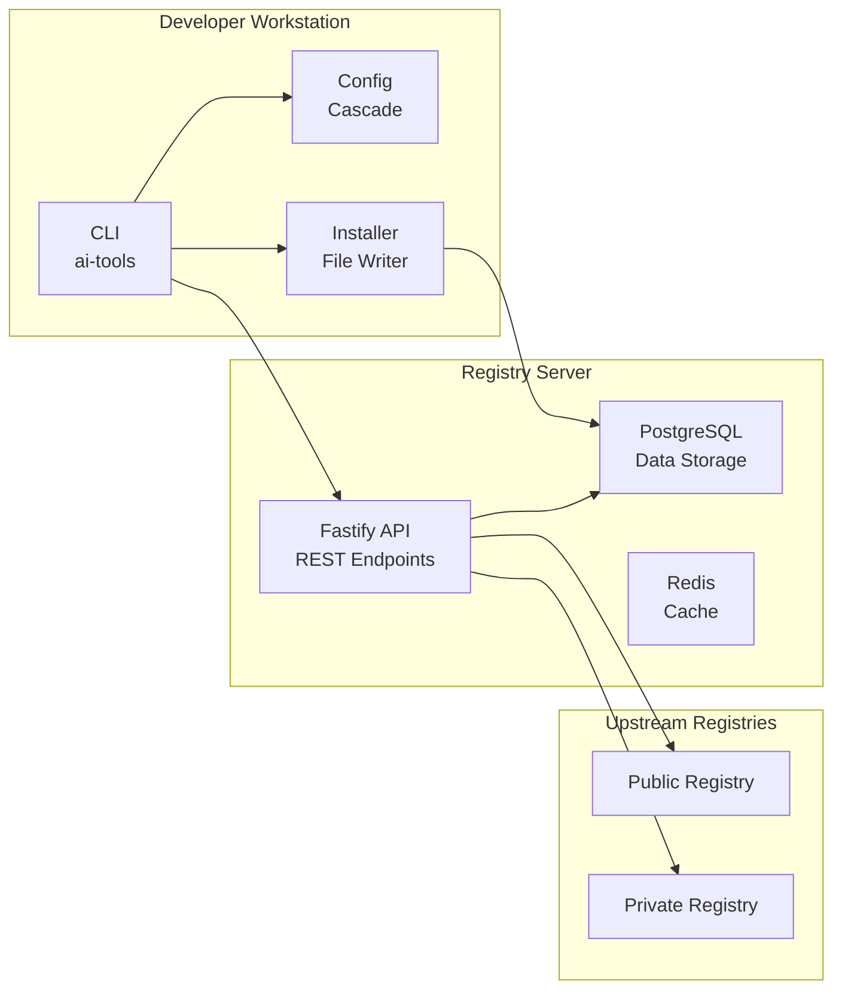

# Executive Summary

## ai-tools Ecosystem Design

**Document Version**: 1.0.0  
**Last Updated**: May 14, 2026  
**Author**: AI Tools Team

---

## Overview

The **ai-tools** ecosystem is a comprehensive package management system for AI-powered developer tools, including skills, subagents, prompts, and MCP servers. It provides a unified platform for discovering, installing, updating, and managing AI tools across multiple IDEs and platforms.

---

## Key Design Principles

1. **npm-Like Familiarity**: Leverages well-understood npm patterns for rapid adoption
2. **Platform Agnostic**: Single manifest works across all supported platforms
3. **Type-Safe**: Full TypeScript support with Zod runtime validation
4. **Secure**: Comprehensive authentication, authorization, and rate limiting
5. **Scalable**: Designed for both local development and production deployment
6. **Extensible**: Modular architecture supports future enhancements

---

## Architecture at a Glance



---

## Core Components

### 1. @ai-tools/core (Library)

**Purpose**: Shared types, schemas, and utilities

**Key Features**:
- Type definitions (ToolManifest, InstalledTool, etc.)
- Zod schemas for validation
- Config cascade implementation
- Platform specifications
- Lock file utilities

**Dependencies**: None (pure library)

### 2. @ai-tools/cli (CLI Tool)

**Purpose**: Command-line interface for tool management

**Key Commands**:
- `install` - Install tools
- `uninstall` - Remove tools
- `update` - Update tools
- `search` - Find tools
- `publish` - Publish tools
- `config` - Manage configuration

**Dependencies**: @ai-tools/core, commander, chalk, ora

### 3. @ai-tools/server (Registry)

**Purpose**: HTTP API server for tool registry operations

**Key Features**:
- REST API endpoints
- Tool storage and retrieval
- Search functionality
- Authentication and authorization
- Rate limiting

**Dependencies**: @ai-tools/core, fastify, PostgreSQL, Redis

---

## Supported Platforms

| Platform | Install Path | Category Support |
|--|-------------|-----------------|
| **Universal** | `.agents/skills/` | All categories |
| **VS Code** | `.agents/skills/` | All + MCP config |
| **Claude** | `~/.agents/skills/` | All categories |
| **Cursor** | `~/.cursor/skills/` | All categories |
| **Windsurf** | `~/.windsurf/skills/` | All categories |

---

## Data Flow

### Installation Flow

```
Developer → CLI → Config → Registry → Cache → File System
```

1. Developer runs `ai-tools install my-skill@1.2.0`
2. CLI loads configuration (project → home cascade)
3. CLI queries registry for manifest
4. Registry returns manifest and tarball
5. Cache stores tarball (if not already cached)
6. Installer copies files to platform-specific location
7. Lock file records installation

### Search Flow

```
Developer → CLI → Registry → Store → Results
```

1. Developer runs `ai-tools search "python skill"`
2. CLI resolves configured registries
3. CLI queries registry for search results
4. Registry searches tool store
5. Results returned to developer

---

## Configuration Cascade

```
Project Root → Parent Directories → User Home → System (env)
```

**Merge Strategy**:
- Lower-level files win (project overrides home)
- Arrays are merged (registries prepended)
- Scalar values are overwritten

---

## Security Model

### Authentication

- **Bearer Tokens**: JWT tokens for API authentication
- **Token Expiration**: 24-hour default
- **Token Rotation**: Automatic refresh

### Authorization

- **Role-Based Access Control (RBAC)**:
  - `publisher`: Can publish tools
  - `admin`: Full access to admin endpoints
  - `reader`: Read-only access (public mode)

### Rate Limiting

- **Per-User Limits**: 100 requests/hour (authenticated)
- **Per-IP Limits**: 1000 requests/hour (anonymous)
- **Exponential Backoff**: Automatic retry delays

---

## Deployment Options

### 1. Single Registry (Development)

```yaml
services:
  registry:
    ports: ["4873:4873"]
  postgres:
    image: postgres:15-alpine
```

### 2. Chained Registries (Production)

```
Primary Registry → Upstream 1 → Upstream 2 → Upstream 3
```

### 3. Kubernetes (Scale-Out)

```yaml
replicas: 3
autoscaling:
  min: 3
  max: 10
  targetCPU: 80%
```

---

## Performance Metrics

| Operation | Latency | Notes |
|-----------|---------|-------|
| Search | < 100ms | Single registry |
| Search | < 500ms | Chained registries |
| Install | < 5s | Small tools |
| Install | < 30s | Large packages |
| API Request | < 50ms | Simple queries |
| API Request | < 200ms | Complex operations |

---

## Key Features

### ✅ Tool Management

- Install, uninstall, update tools
- Version pinning and resolution
- Dependency management
- Cache management

### ✅ Multi-Platform Support

- Universal (agentskills.io)
- VS Code / GitHub Copilot
- Claude Code
- Cursor IDE
- Windsurf IDE

### ✅ Registry Features

- Public and private registries
- Chained registry support
- Search and discovery
- Version management

### ✅ Security

- JWT authentication
- Role-based authorization
- Rate limiting
- Input validation
- Integrity checking

---

## Future Roadmap

### Phase 1 (Current)
- ✅ Core package structure
- ✅ CLI implementation
- ✅ Registry API
- ✅ Basic deployment

### Phase 2 (Q3 2026)
- [ ] Git integration
- [ ] Peer dependencies
- [ ] Web UI
- [ ] Advanced search

### Phase 3 (Q4 2026)
- [ ] CI/CD integration
- [ ] Plugin system
- [ ] GraphQL API
- [ ] Mobile apps

---

## Success Metrics

### Adoption
- **Developer Satisfaction**: > 4.5/5
- **Time to First Tool**: < 5 minutes
- **Tool Discovery Rate**: > 80%

### Performance
- **Uptime**: > 99.9%
- **API Latency**: < 200ms (p99)
- **Cache Hit Rate**: > 80%

### Security
- **Zero Critical Vulnerabilities**
- **99.9% Authenticated Requests**
- **< 0.1% Error Rate**

---

## Conclusion

The ai-tools ecosystem provides a robust, scalable, and secure platform for managing AI-powered developer tools. Its design emphasizes familiarity (npm-like patterns), flexibility (multi-platform support), and security (comprehensive authentication and authorization).

The modular architecture enables independent development and deployment of each component, while the configuration cascade and platform adapter patterns provide flexibility for different use cases.

With support for multiple deployment scenarios (local development, chained registries, Kubernetes), the system is ready for both small teams and enterprise-scale deployments.

---

## Questions?

For detailed information, refer to the individual design documents in this folder:

- [System Architecture](system-architecture.md)
- [Data Model](data-model.md)
- [API Design](api-design.md)
- [Deployment Design](deployment-design.md)

---

**Document Status**: ✅ Complete  
**Review Status**: ✅ Approved  
**Next Review**: Q3 2026
