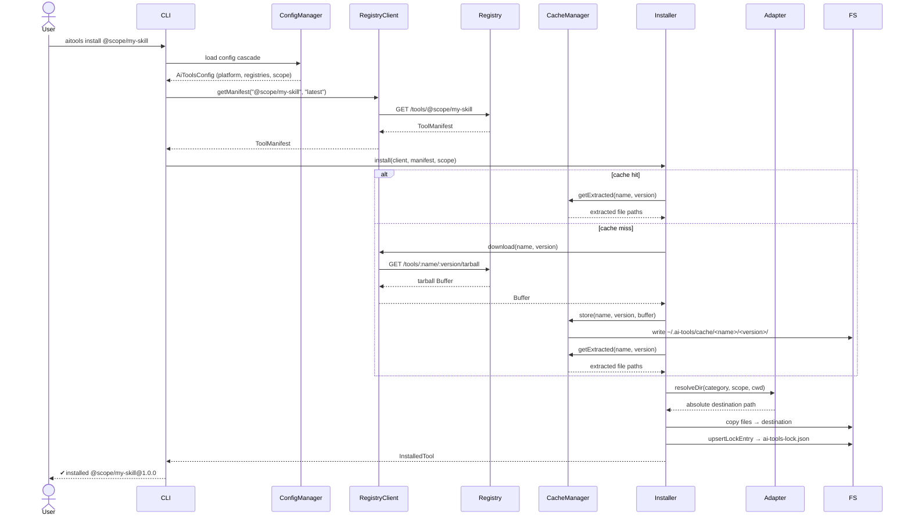
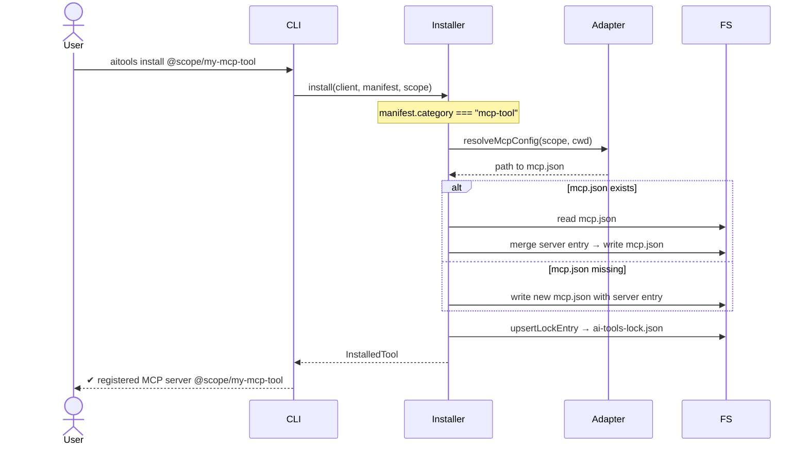
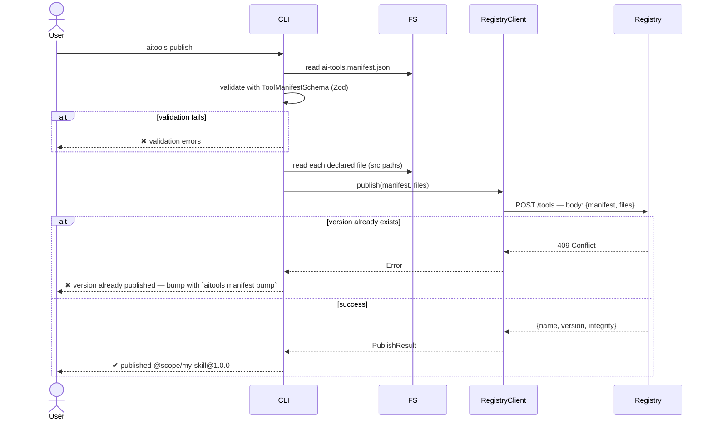
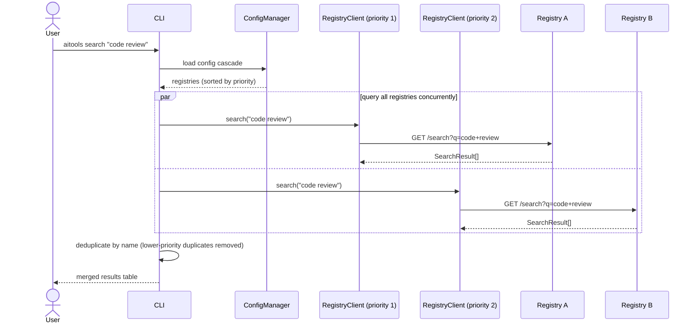
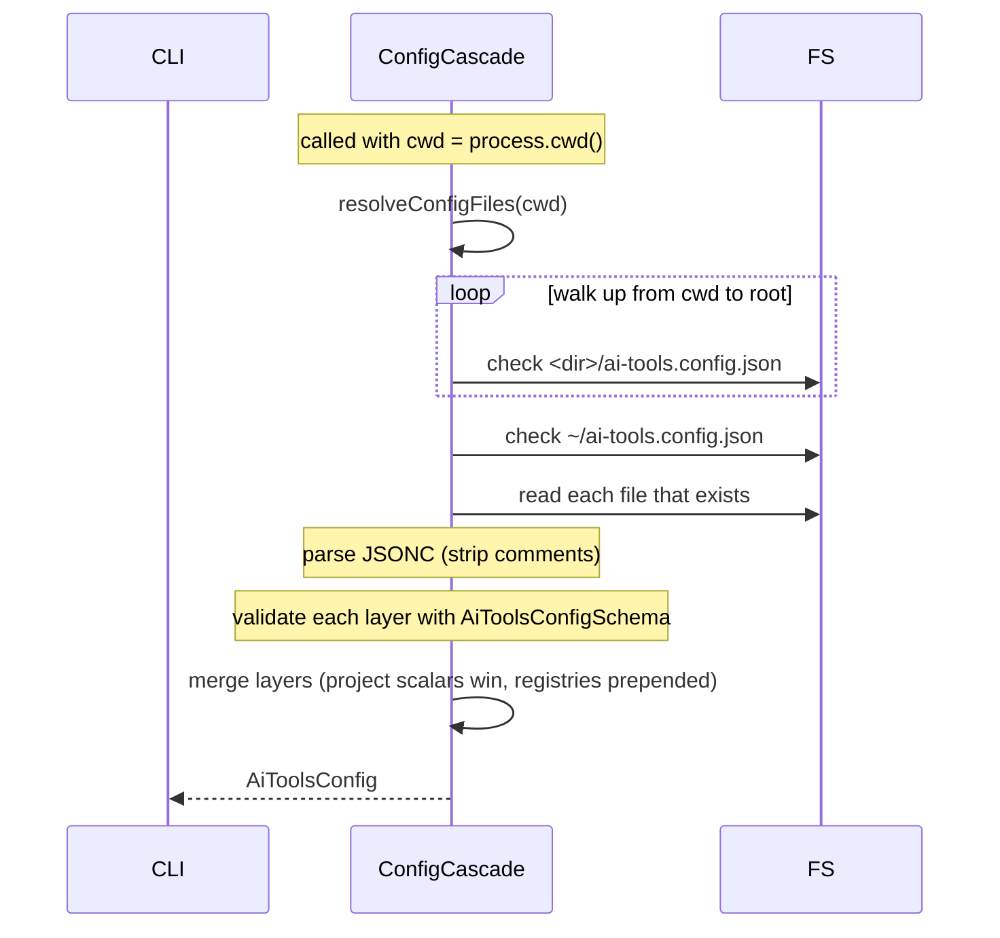
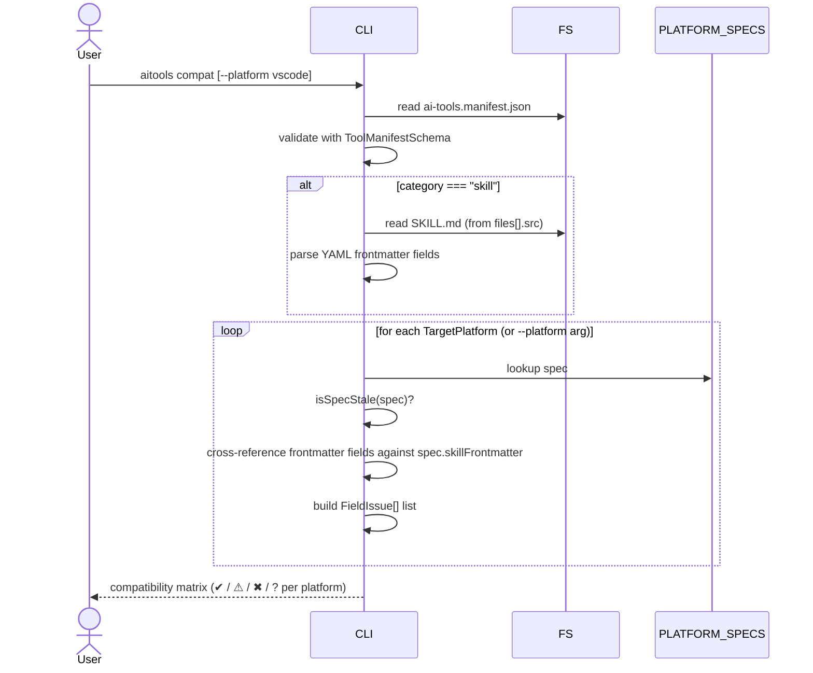

# Key Flows

Sequence diagrams for the primary operations. Actor abbreviations:

- **User** — developer running the CLI
- **CLI** — `aitools` binary (Commander entry + command handler)
- **ConfigManager** — reads and merges `aitools.config.json` cascade
- **Installer** — downloads and writes files
- **CacheManager** — local tarball cache at `~/.ai-tools/cache/`
- **Adapter** — platform-specific path resolver
- **RegistryClient** — HTTP client for a single registry endpoint
- **Registry** — `@ai-tools/server` (or any compatible registry)
- **FS** — local file system

---

## Install flow

---

## MCP tool install flow

MCP tools do not write files — they inject a server entry into the platform's `mcp.json`.

---

## Publish flow

---

## Search flow (multi-registry)

---

## Config cascade load

---

## `compat` audit flow

