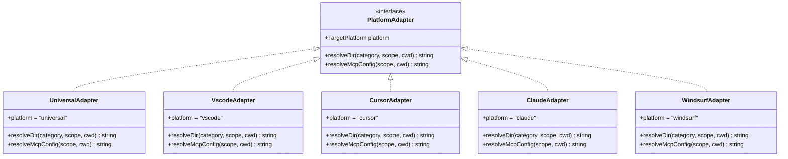
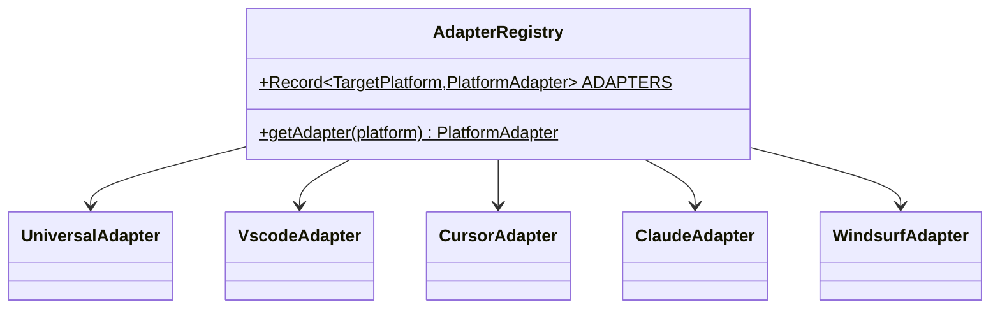
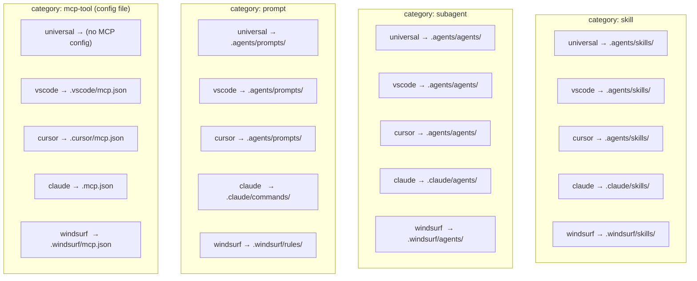
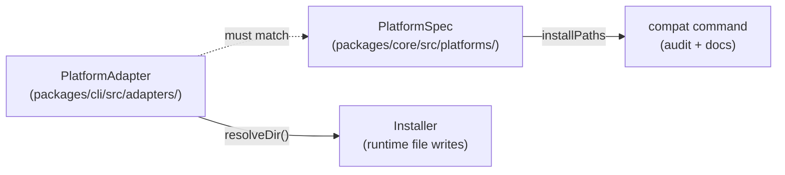
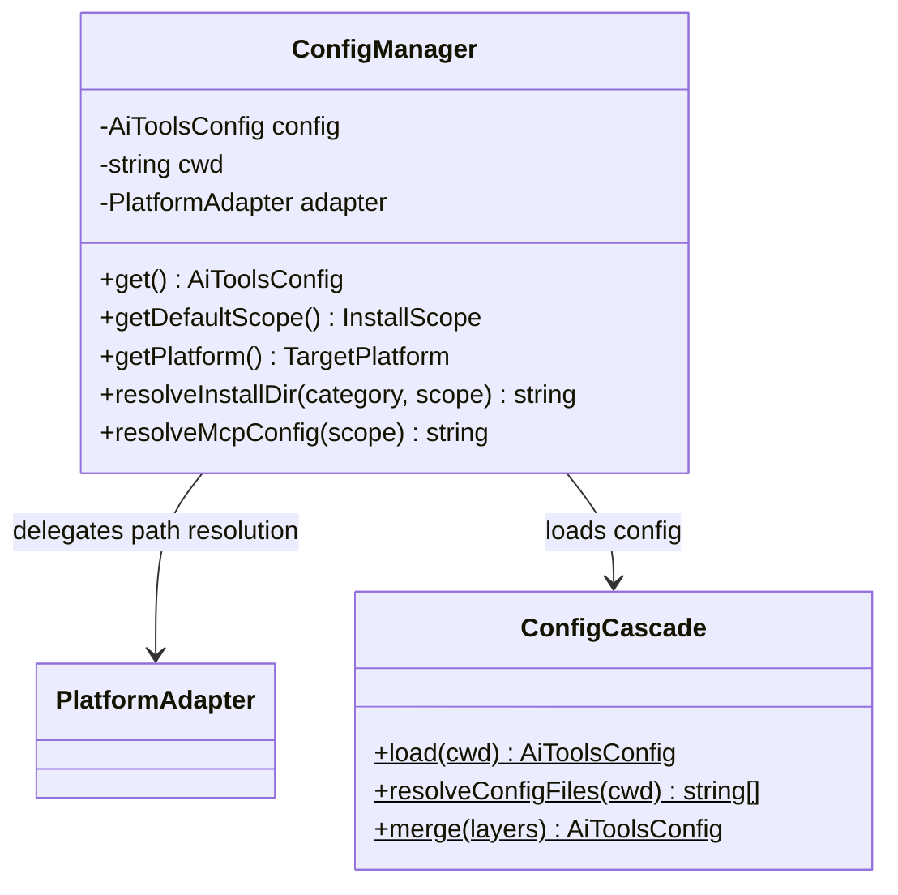
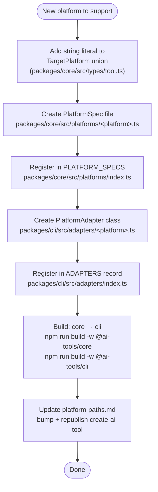

# Platform Adapter Pattern

The platform adapter pattern decouples the installer from the concrete directory
structure of each IDE. The installer always asks "where does a `skill` go for
`project` scope?" — the adapter answers differently per platform.

---

## Interface and implementations



---

## Adapter registry

`getAdapter(platform)` is a simple lookup — no dynamic dispatch or DI container.



---

## Spec Staleness

Platform specs are considered stale if `lastVerified` is more than **90 days** old.
The `compat` command warns about stale specs to encourage regular verification.

```typescript
// packages/core/src/platforms/index.ts
export const SPEC_STALE_DAYS = 90;

export function isSpecStale(spec: PlatformSpec): boolean {
  const verified = new Date(spec.lastVerified);
  const ageMs = Date.now() - verified.getTime();
  return ageMs > SPEC_STALE_DAYS * 24 * 60 * 60 * 1000;
}
```

---

## Resolved install paths per platform

The install paths each adapter returns for **project scope**:



---

## Relationship between adapter and PlatformSpec

The adapter handles **runtime installs**. The `PlatformSpec` handles **compatibility
auditing and documentation**. They encode the same install paths and must stay in sync.



When a platform changes its install paths:
1. Update the adapter `DIRS` object (runtime behaviour)
2. Update the spec `installPaths` (audit + documentation)
3. Update `tools/create-ai-tool/references/platform-paths.md` (published reference)

See `.agents/skills/update-platform-spec/SKILL.md` for the step-by-step process.

---

## ConfigManager integration

`ConfigManager` bridges config, adapter selection, and path resolution for commands.



---

## Adding a new platform — decision flow



See `.agents/skills/add-platform/SKILL.md` for full details and gotchas.

