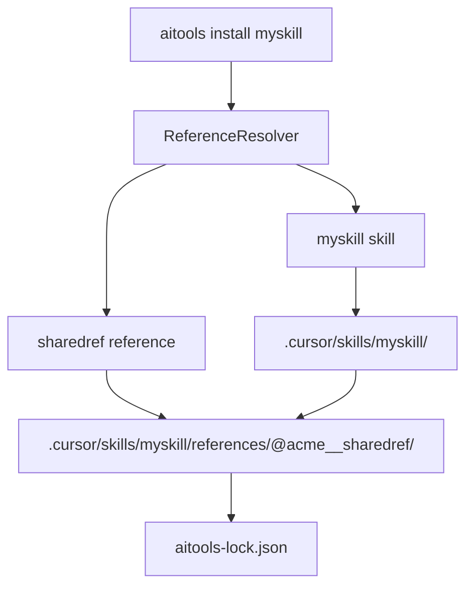
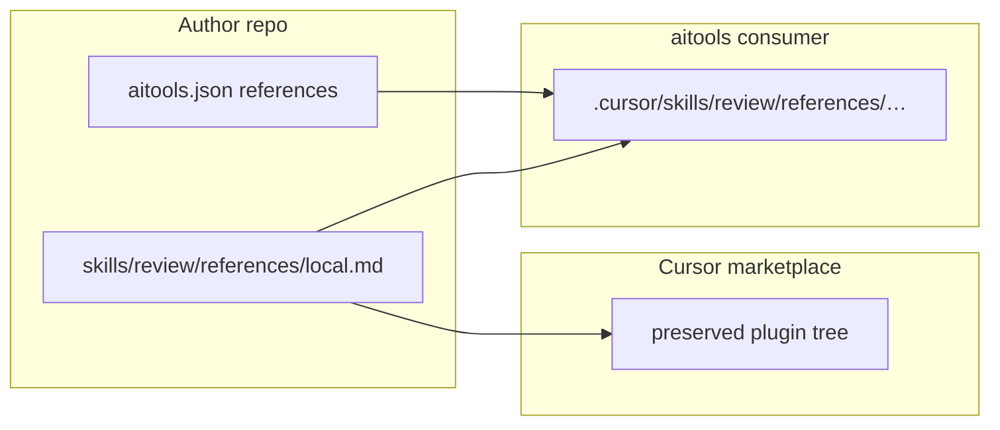

# Shared references

**Status**: Core planning module implemented; CLI installer integration pending  
**Last updated**: July 2026

This document defines how aitools reuses markdown write-ups and resource link lists across skills and plugins — for example, an accessibility checklist consumed by multiple higher-level skills.

See also: [Plugin marketplaces vs aitools registry](plugin-marketplaces-comparison.md), [Data model](data-model.md), [Key flows](flows.md).

---

## Design philosophy

**Functional tools first.** A skill must work as a self-contained unit an agent can invoke without resolving a cross-project dependency graph. The primary deliverable is a working skill, not a shared-content management system.

**DRY when we can; duplication when DRY may not be practical.** Publishing `sharedref` once to the registry avoids authors manually copy-pasting the same markdown into N skill repos. At install time, each consumer gets its **own vendored copy** — we accept on-disk duplication because a central shared store across N unknown consumers would be impractical to manage.

### Why not a global shared install path?

Managing one canonical copy of `sharedref` across N skills — especially when you don't know upfront which skills will consume it — adds complexity we do not want:

- Cross-skill dependency graphs and refcounting
- "Who still needs this?" logic on uninstall/update
- Path resolution from arbitrary skill trees to a global references directory
- Coordination when one consumer needs `sharedref@2` and another needs `sharedref@1`

Vendoring sidesteps that: the parent package owns its copies, the lock file records provenance, and uninstall removes tracked paths.

### What DRY we do get

| Layer | DRY benefit |
|-------|-------------|
| **Authoring / registry** | Write `sharedref` once, publish once; many packages declare `references: { "sharedref": "^2.0.0" }` |
| **Install / runtime** | Each skill is isolated — no shared mutable state, no cross-skill coupling |
| **Lock file** | Per-package provenance only — no global reference registry to maintain |

---

## Problem statement

Today, reference material only works **within a single package**:

- Skills bundle `references/` via explicit `files[]` and link relatively from `SKILL.md` (see `project-changelog` in this repo).
- Plugin `assets/` and `scripts/` install under `.cursor/skills/<pkg>/…` with path rewriting (`packages/cli/src/transformers/path-rewrite.ts`).
- `ToolManifest.dependencies` is validated and published but **never resolved at install** — see [plugin marketplaces comparison](plugin-marketplaces-comparison.md).

**Consequence:** To reuse an accessibility checklist across skills, authors must manually copy markdown into each skill's `files[]` and maintain versions by hand. There is no aitools workflow to vendor a registry reference into a skill with lock-file provenance.

---

## Proposed model

### Overview

Given a skill `myskill` that uses a reference package `sharedref`:

1. aitools supports `category: "reference"` as a publishable package type.
2. Installing `sharedref` **into** `myskill` copies reference files under the skill's install tree.
3. `myskill` links to the vendored copy via a stable relative path (e.g. `./references/@acme__sharedref/checklist.md`).
4. `aitools-lock.json` records which reference version was installed, where it came from (registry URL, integrity), and which parent package owns the copy.

References are **not** installed to a global `.cursor/references/` path. Each consuming package gets its own vendored copy.

---

## Reference package format (`category: "reference"`)

Reference packages are **libraries, not invocable skills**. They are published to the registry but are intended to be installed **into** a parent skill or plugin — not as standalone top-level consumer installs.

### Author layout

Flat files at package root — **no** nested `references/` folder inside the published package:

```text
sharedref/
├── aitools.json          # category: "reference"
├── checklist.md
├── sources.md
└── index.md              # optional: what this library covers
```

Example `files[]`:

```json
"files": [
  { "src": "checklist.md", "dest": "checklist.md" },
  { "src": "sources.md", "dest": "sources.md" }
]
```

**Validation:** at least one non-metadata content file (not just `aitools.json` / `index.md`).

Standalone `aitools install sharedref` should warn or reject — reference packages are meant to be vendored into a parent.

---

## Vendored install — flatten on write

The lock file tracks every installed path, so the installer does **not** need to mirror the publisher's internal package tree. For `category: "reference"`, aitools **flattens** ref files into the parent's skill `references/` folder.

### Default layout (`layout: "named"`)

Named subfolder per ref — supports multiple refs without filename collisions. Folder name uses `sanitizePackageDirName` (`@acme/sharedref` → `@acme__sharedref`).

```text
.cursor/skills/myskill/
├── SKILL.md
└── references/
    └── @acme__sharedref/
        ├── checklist.md
        └── sources.md
```

Link from `SKILL.md`:

```markdown
Read the checklist: [./references/@acme__sharedref/checklist.md](./references/@acme__sharedref/checklist.md)
```

### Optional flat layout (`layout: "flat"`)

Merge ref files directly into the skill's `references/`:

```text
.cursor/skills/myskill/
├── SKILL.md
└── references/
    ├── checklist.md
    └── sources.md
```

Use only when one registry ref applies (or filenames are prefixed to avoid collision with authored static files). Set per binding: `{ "range": "^2.0.0", "layout": "flat" }`.

### Rejected layout

Nested `references/<ref>/references/checklist.md` is **not** used. The outer `references/` is the skill's Cursor-native directory; an inner `references/` was an artifact of mirroring package layout and is unnecessary when the lock tracks exact paths.

### Install steps

When a parent declares a reference and is installed:

1. Resolve the ref package from the registry (semver range → exact version).
2. **Flatten** ref package files into the parent's `references/` tree (per `layout`).
3. Record exact paths in the parent's lock entry for uninstall/update.



---

## `references` manifest field

Skills and plugins declare reference deps in a dedicated `references` field — separate from generic `dependencies` (which may later cover other package types).

`references` only accepts `category: "reference"` packages; install always vendors into the parent.

### Shorthand

Uses category default `into` (see [Plugin integration](#plugin-integration)):

```json
{
  "name": "myskill",
  "category": "skill",
  "references": {
    "sharedref": "^2.0.0"
  }
}
```

### Object form

When install location or layout must be explicit:

```json
{
  "references": {
    "sharedref": {
      "range": "^2.0.0",
      "into": ["skills/review", "skills/audit"],
      "layout": "named"
    },
    "@acme/a11y-checklist": {
      "range": "^1.0.0",
      "into": "skills/review"
    }
  }
}
```

| Field | Meaning |
|-------|---------|
| `range` | Semver range (required in object form) |
| `into` | `string` or `string[]` — bundle-relative skill paths (plugins); `"self"` for standalone skills |
| `layout` | `"named"` (default) or `"flat"` |

Reusing `dependencies` with category-aware install routing is **deferred** — explicit `references` keeps semantics clear.

---

## Lock file extensions

Extend `LockEntry` (`packages/core/src/types/lock.ts`) with a nested `references` map on the **parent package's** lock entry.

```json
{
  "lockfileVersion": 1,
  "tools": {
    "myskill": {
      "version": "1.0.0",
      "resolved": "https://registry.example/api/tools/myskill",
      "integrity": "sha256-…",
      "category": "skill",
      "scope": "project",
      "platform": "cursor",
      "files": [
        ".cursor/skills/myskill/SKILL.md",
        ".cursor/skills/myskill/references/@acme__sharedref/checklist.md",
        ".cursor/skills/myskill/references/@acme__sharedref/sources.md"
      ],
      "references": {
        "sharedref": {
          "version": "2.1.0",
          "resolved": "https://registry.example/api/tools/sharedref",
          "integrity": "sha256-…",
          "layout": "named",
          "installedAt": "2026-07-15T04:00:00.000Z",
          "installs": [
            {
              "into": "self",
              "destWithinCategory": "myskill/references/@acme__sharedref",
              "files": [
                ".cursor/skills/myskill/references/@acme__sharedref/checklist.md",
                ".cursor/skills/myskill/references/@acme__sharedref/sources.md"
              ]
            }
          ]
        }
      }
    }
  }
}
```

For plugins with fan-out, `installs[]` has one entry per `into` target.

**Properties:**

- Know exactly which reference version is vendored and **where** (multiple installs per ref supported).
- `aitools update` re-resolves the range once and refreshes **all** install locations for that ref.
- `aitools uninstall` removes every path in `files` plus every path in `references.*.installs[].files`.
- No separate top-level lock entry for vendored refs — they are owned by the parent package.

`lockfileVersion: 1` gains an optional `references` block (backward compatible).

---

## CLI workflows

### Declarative (primary)

```bash
aitools install myskill          # installs skill + vendors declared references
aitools update myskill           # updates skill + re-resolves reference versions
aitools uninstall myskill        # removes skill tree including vendored refs
```

### Explicit (authoring / adding a ref)

```bash
aitools reference install sharedref --into myskill
aitools reference install @acme/a11y-checklist@2.1.0 --into myskill
aitools reference list myskill   # show vendored refs + versions from lock
aitools reference update myskill # refresh all reference ranges for a package
```

Command names are proposals; a `reference` subcommand keeps install-into semantics explicit.

### Update and uninstall semantics

| Action | Behavior |
|--------|----------|
| `aitools update <pkg>` | Bump package if range allows; re-resolve each `references` entry; replace vendored files; update lock `references.*` |
| `aitools uninstall <pkg>` | Delete all paths in `files` + every `references.*.installs[].files`; remove lock entry |
| `aitools reference install X --into <pkg>` | Add/update vendored copy; upsert `references.X` in lock; update publish manifest when authoring in source repo |
| `aitools install sharedref` (standalone) | Warn or reject |

---

## Plugin integration

Plugins are **not** installed as a preserved tree by aitools. The author repo, Cursor marketplace install, and aitools install are **three different filesystem shapes**.

### Three filesystem views

**1. Author dev repo** (Cursor-strict layout):

```text
my-plugin/
├── .cursor-plugin/plugin.json
├── aitools.json                            # references: { … } — manifest only
├── skills/
│   ├── review/
│   │   ├── SKILL.md
│   │   └── references/                     # authored static only (in files[])
│   │       └── local-checklist.md
│   └── audit/
│       └── SKILL.md
├── rules/
├── assets/logo.svg                         # plugin root (Cursor-native)
└── scripts/
```

- Registry refs are **declared in `aitools.json`**, not present as files in the repo.
- Cursor rule: `references/` only under `skills/<name>/`, never at plugin root.
- No `@team__pkg/` synthetic dirs in the author tree.

**2. Cursor marketplace consumer** (`~/.cursor/plugins/local/<plugin>/`):

```text
~/.cursor/plugins/local/my-plugin/
├── skills/review/SKILL.md
├── skills/review/references/local-checklist.md
├── assets/logo.svg                         # still at plugin root
└── …
```

- Whole tree preserved — same relative paths as author repo.
- **No registry vending** — `sharedref` does not appear unless the author manually committed copies.

**3. aitools consumer** (`aitools install` — explode):

```text
my-project/
├── aitools.json
├── aitools-lock.json
└── .cursor/
    ├── skills/
    │   ├── review/
    │   │   ├── SKILL.md
    │   │   └── references/
    │   │       ├── local-checklist.md
    │   │       └── @acme__sharedref/
    │   │           ├── checklist.md
    │   │           └── sources.md
    │   ├── audit/
    │   │   └── references/@acme__sharedref/   # fan-out copy
    │   └── @team__my-plugin/                  # assets/scripts ONLY
    │       └── assets/logo.svg
    ├── rules/
    └── mcp.json
```

| Aspect | Author repo | Cursor marketplace | aitools install |
|--------|-------------|-------------------|-----------------|
| Plugin tree preserved | yes (source) | yes | **no — exploded** |
| `skills/<name>/references/` | authored static | same | same under `.cursor/skills/` |
| Registry `sharedref` | manifest only | not available | vendored under skill `references/` |
| `assets/` location | plugin root | plugin root | `@team__pkg/assets/` (synthetic) |

### Cursor plugin alignment

Per [Cursor Plugins Reference](https://cursor.com/docs/reference/plugins) and [Agent Skills](https://cursor.com/docs/skills):

- Plugin root discovers: `skills/`, `rules/`, `agents/`, `commands/`, `hooks/`, `mcp.json`, `assets/`, `scripts/` — **not** `references/`.
- `references/` is an optional directory **inside each skill folder**.
- Plugin-wide static content uses `assets/` at plugin root.

**Do not** use `into: "plugin"` → `@team__pkg/references/` for registry refs. That path does not exist in Cursor's layout. Synthetic package dirs are for `assets/` and `scripts/` only (`packages/core/src/manifest/plugin-explode.ts`). Registry refs vend **only** into `skills/<name>/references/<ref>/`.

### Install targets (`into`)

`into` values are **bundle-relative** paths in the plugin repo (under `skills/`):

| `into` value | Meaning | aitools consumer path |
|--------------|---------|----------------------|
| `"skills/review"` | one skill | `.cursor/skills/review/references/@acme__sharedref/…` |
| `["skills/review", "skills/audit"]` | fan-out | copy under each skill's `references/` |
| `"all-skills"` | derived fan-out | every `skills/*/SKILL.md` parent in bundle |
| ~~`"plugin"`~~ | **rejected** | does not match Cursor layout |

- **`category: plugin`**: require explicit `into` (string or array).
- **`category: skill`**: default `into: "self"`.

### Multi-location install

When multiple plugin skills need `sharedref`, fan-out to each skill folder — one registry fetch, N copies:

```json
"references": {
  "sharedref": {
    "range": "^2.0.0",
    "into": ["skills/review", "skills/audit"]
  }
}
```

Each skill links locally: `./references/@acme__sharedref/checklist.md`

**Install algorithm:**

1. Resolve `sharedref` once (download + integrity check).
2. For each `into` target, flatten ref files to `.cursor/skills/<name>/references/<refName>/` (or `references/` root if `layout: "flat"`).
3. Write identical file tree to each target.
4. Lock: one `references.sharedref` entry with `installs[]` per target.



Registry refs are **consumer install artifacts** — they never appear in the published plugin tarball's `files[]`.

### Dev workflow

Authors do not commit vendored copies. To test:

```bash
cd my-test-project
aitools install @team/my-plugin

# or explicitly:
aitools reference install sharedref --into @team/my-plugin \
  --targets skills/review,skills/audit
```

Run install against a **test project** cwd, not into the plugin source tree.

### Install configurability

Authors set `into` in the publish manifest. Consumers can override via `aitools.config.json`:

```json
{
  "referenceBindings": {
    "@team/my-plugin": {
      "sharedref": { "into": ["skills/review", "skills/audit"] }
    }
  }
}
```

**Precedence:** package manifest `into` → `referenceBindings` override.

### Rules and agents

Rules install to `.cursor/rules/`, not under `skills/`. Registry refs vend only into skill `references/` folders in v1. Rules that need shared content should link to a skill that holds the ref, use authored static content, or rely on fan-out into a consuming skill. Per-rule `into: "rules/…"` is **deferred**.

### Per-skill sidecar manifests

**v1:** plugin-level `aitools.json` only; use `into: "skills/<name>"` per ref entry. Sidecar manifests or SKILL.md frontmatter `references:` are deferred.

---

## Author and consumer workflows

### Author — reference package

```bash
mkdir sharedref && cd sharedref
# checklist.md, sources.md, aitools.json (category: reference)
aitools manifest validate
aitools publish
```

### Author — composing skill

```json
{
  "name": "myskill",
  "category": "skill",
  "references": { "sharedref": "^2.0.0" },
  "files": [{ "src": "SKILL.md", "dest": "myskill/SKILL.md" }]
}
```

### Consumer — plugin with shared ref

```bash
aitools install @team/my-plugin
# skills explode to .cursor/skills/review/, .cursor/skills/audit/, …
# sharedref vendored per into[] under each skill's references/
# lock entry includes references.sharedref.installs[] per target
```

---

## Migration guide

**From manual copy in `files[]`:**

1. Extract shared markdown into a `category: "reference"` package; publish to registry.
2. Remove duplicate `files[]` entries from consuming skills/plugins.
3. Add `references: { "<name>": "^x.y.z" }` to each consumer manifest.
4. Update `SKILL.md` links to `./references/<refName>/checklist.md` (named layout).
5. Run `aitools install` / `aitools update` in consumer projects; commit updated `aitools-lock.json`.

**From authored static refs in plugins:** keep skill-local `skills/<name>/references/` for plugin-owned content; use registry `references` only for shared packages vendored at install time.

---

## Non-goals

- Global `.cursor/references/` install path or shared mutable store
- Cross-skill deduplication (N skills = N copies on disk — accepted cost)
- Refcounting, reverse-dependency tracking, or orphan cleanup across skills
- Install-time dependency graph resolver for references (flat: parent declares refs, aitools vendors them)
- Transitive reference chains in v1 (`sharedref` cannot vendor other refs)
- Project `.ai/references/` overrides — deferred
- Automatic inference of `into` from skill content
- `into: "plugin"` synthetic hub for registry refs
- Per-skill sidecar manifests in v1
- Standalone top-level install of reference packages

---

## Decided defaults

| Topic | Default |
|-------|---------|
| **Vendored layout** | `layout: "named"` → `references/<refName>/checklist.md`; `layout: "flat"` only for single-ref or prefixed filenames |
| **Reference package format** | Flat files at package root — no `references/` folder inside the published ref package |
| **Ref folder name** | `sanitizePackageDirName` always (`@acme__sharedref`) |
| **Plugin multi-skill refs** | `into` must be bundle-relative skill paths (`skills/<name>` or array); **no `into: "plugin"`** |
| **`all-skills`** | Supported as derived fan-out; explicit array preferred when only some skills need the ref |
| **Nested reference refs** | **No in v1** — reference packages are leaf packages |
| **Lock file version** | Optional `references` block on `lockfileVersion: 1` (backward compatible) |
| **Per-skill sidecars** | **No in v1** |
| **Config override** | `referenceBindings` in `aitools.config.json` overrides manifest `into` |
| **Standalone `aitools install <ref>`** | Warn or reject |
| **`aitools list`** | Distinguish direct installs; vendored refs appear under parent lock entry only |
| **Registry discovery** | `category: "reference"` tag/filter for search (implementation detail) |

---

## Implementation roadmap

| Phase | Scope | Key files |
|-------|-------|-----------|
| **1** | `reference` category + `references` field schema | `types/tool.ts`, `schema/tool-schema.ts` |
| **2** | `ReferenceResolver` + multi-target `into` (`string \| string[] \| all-skills`) | `packages/core/src/resolve/` |
| **3** | Vendor install — fetch once, write to N locations | `installer.ts` |
| **4** | Lock extensions — `references.*.installs[]` | `types/lock.ts`, `config-schema.ts` |
| **5** | `referenceBindings` in `aitools.config.json` | `config-schema.ts`, `config-manager.ts` |
| **6** | Install/update/uninstall orchestration | `install.ts`, `update.ts`, `uninstall.ts` |
| **7** | Plugin explode alignment (no top-level `references/` bundle root) | `plugin-explode.ts`, `path-rewrite.ts` |
| **8** | `aitools reference` subcommand | `commands/reference.ts` |
| **9** | Authoring docs + scaffold | `create-ai-tool/`, `manifest-reference.md` |
| **10** | E2E tests | plugin fan-out + lock `installs[]` |

---

## Related code

| Area | Path |
|------|------|
| Lock types | `packages/core/src/types/lock.ts` |
| Plugin explode | `packages/core/src/manifest/plugin-explode.ts` |
| Path rewrite | `packages/cli/src/transformers/path-rewrite.ts` |
| Installer | `packages/cli/src/utils/installer.ts` |
| Manifest reference | `tools/create-ai-tool/references/manifest-reference.md` |
