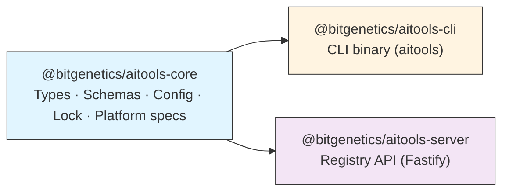
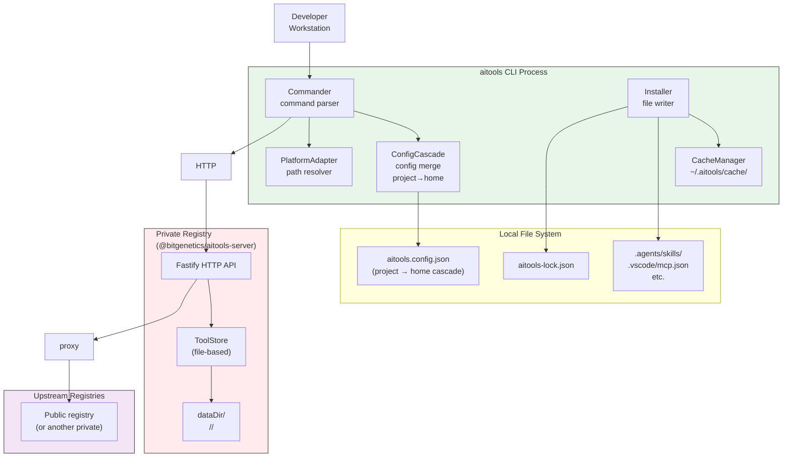
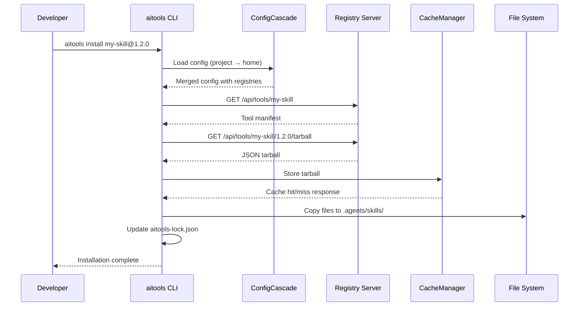
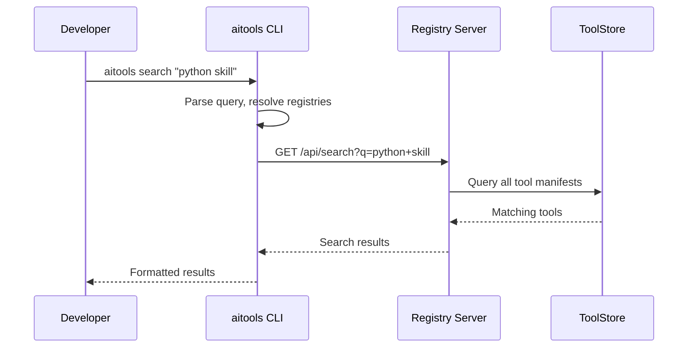

# System Architecture

## Overview

**ai-tools** is a package manager for AI tools — skills, subagents, prompts, and MCP servers — modeled closely on npm. It provides a unified ecosystem for discovering, installing, updating, and managing AI-powered developer tools across multiple IDEs and platforms.

---

## Package Structure

The project is organized as a monorepo with four packages:

```
ai-tools/
├── packages/
│   ├── @bitgenetics/aitools-core/      # Pure library: types, schemas, utilities
│   ├── @bitgenetics/aitools-cli/       # CLI binary (aitools command)
│   ├── @bitgenetics/aitools-server/    # Registry API (Fastify HTTP server)
│   └── @bitgenetics/aitools-e2e/       # Docker-based end-to-end tests
├── docs/
└── sandbox/                 # Local testing sandbox
```

### Package Dependency Graph



**Key Design Decisions:**
- `@bitgenetics/aitools-core` has **no runtime dependencies** on cli or server
- Both `cli` and `server` depend on `core` for types and schemas
- This separation enables independent testing and deployment of each package

---

## Runtime Topology

### Developer Workstation



### Deployment Scenarios

1. **Single Registry**: Developer CLI connects to one private registry server
2. **Chained Registries**: Multiple registries form a chain for load balancing and failover
3. **Public + Private**: Public registry for discovery, private for publishing
4. **Git-backed Registry**: No HTTP server — tools live in a git repo; CLI clones locally and uses system git credentials

The CLI dispatches to `HttpRegistryClient` or `GitRegistryClient` based on `registries[].type` in config (`http` is the default when `type` is omitted).

---

## Data Flow

### Installation Flow



### Search Flow



---

## Configuration Cascade

The system uses a **config cascade** pattern similar to npm's `.npmrc`:

```
Project Root → Parent Directories → User Home → System (env)
```

### Config Files

1. **`aitools.config.json`** (project root)
   - Registry URLs
   - Default platform
   - Authentication tokens

2. **`~/aitools.config.json`** (user home)
   - Global registry URLs
   - Default settings

3. **Environment Variables** (server only)
   - `AITOOLS_PUBLISH_TOKEN`, `AITOOLS_PUBLISHER_TOKENS`
   - `REGISTRY_ACCESS`, `UPSTREAMS`, `DATABASE_URL`

### Merge Strategy

- **Lower-level files win** (project overrides home)
- **Arrays are merged** (registries are prepended, queried first)
- **Scalar values are overwritten**

```typescript
// Example: Registry cascade (project registries queried first)
Project config:  ["https://private.registry.io"]
Home config:     ["https://public.registry.io"]

Merged result:   ["https://private.registry.io", "https://public.registry.io"]
```

---

## Platform Adapter Pattern

The system supports multiple target platforms through a **platform adapter** pattern:

### Supported Platforms

| Platform | Project skill path | User skill path |
|----------|-------------------|-----------------|
| **Universal** | `.agents/skills/` | `.agents/skills/` |
| **VS Code** | `.agents/skills/` | `~/.copilot/skills/` |
| **Claude** | `.claude/skills/` | `~/.claude/skills/` |
| **Cursor** | `.agents/skills/` | `~/.aitools/tools/skills/` |
| **Windsurf** | `.windsurf/skills/` | `~/.windsurf/skills/` |

VS Code subagents install to `.github/agents/` (project) or `~/.copilot/agents/` (user).

### Platform Detection

The system detects the active platform from:
1. `aitools.config.json` → `platform` field
2. `ConfigManager.detectPlatformFromEnv()` — checks IDE env vars and `.vscode`/`.cursor` directories
3. Default: `universal`

---

## Security Considerations

### Authentication

1. **Bearer Tokens**: Static or database-backed tokens for publishing and org operations
2. **Session Cookies**: Admin portal login via `POST /admin/login`
3. **Rate Limiting**: Per-route limits (e.g. publish: 100/hour)

### Data Protection

1. **Integrity Checking**: SHA-256 hashes for downloaded tarballs
2. **Atomic Writes**: Lock files use write→rename pattern
3. **Input Validation**: Zod schemas for all config/manifest files

### Privacy

1. **Private Tools**: `private: true` in manifest hides from public registries
2. **Local Storage**: All tool data stored locally, not uploaded
3. **No Telemetry**: No analytics or usage tracking

---

## Error Handling

### CLI Errors

- **Exit Codes**: Standard npm-compatible codes (0=success, 1=error)
- **Error Messages**: Colored output (chalk) for visibility
- **Spinner UI**: Loading indicators for long operations

### Server Errors

- **HTTP Status Codes**: Standard Fastify conventions
- **Rate Limiting**: Automatic throttling on excessive requests
- **Circuit Breaker**: Automatic failover on upstream failures

---

## Performance Characteristics

### Caching Strategy

- **Local Cache**: `~/.aitools/cache/` stores downloaded tarballs
- **Cache Hit Ratio**: Typical 80%+ for frequently used tools
- **Cache Invalidation**: Re-download on version change; no dedicated `cache clean` command yet

### Execution Time

- **Search**: < 100ms for single registry, < 500ms for chained
- **Install**: < 5s for small tools, < 30s for large packages
- **Registry API**: < 50ms for simple queries, < 200ms for complex operations

---

## Future Enhancements

1. **Git Integration**: Install from git repositories
2. **Version Pinning**: Pin specific versions in `aitools.json`
3. **Peer Dependencies**: Resolve tool dependencies automatically
4. **Plugin System**: Extend CLI with custom commands
5. **Web UI**: Browser-based registry interface
6. **CI/CD Integration**: Automated publishing from GitHub Actions
